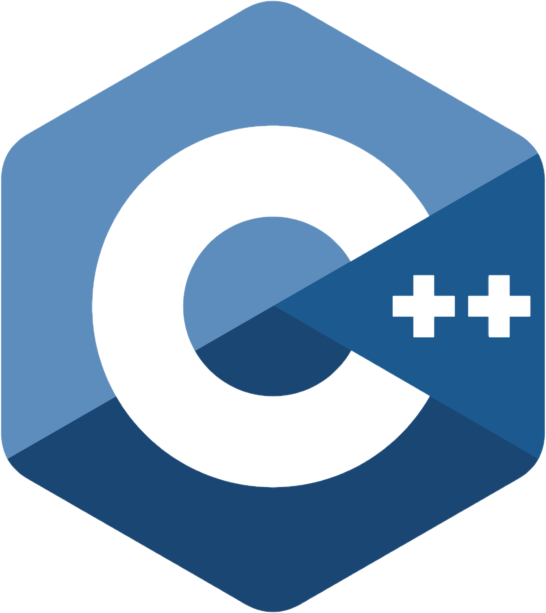

<p align="center">
    <a href="https://www.terrarebels.net/"></a>
</p>

<p align="center">
The Official C++ SDK for the Terra Ecosystem (LUNC/USTC/LUNA2)
</p>
<br/>

<p align="center">
  <a href="https://github.com/terra-rebels/terra-sharp/blob/master/LICENSE.md">
  
  </a>

  <a href="https://www.nuget.org/packages/TerraSharp">
    
  </a>
</p>

<p align="center">
  <a href="https://docs.terra.money/"><strong>Explore the Docs »</strong></a>
  <br />
  <br/>
  <a href="https://github.com/terra-rebels/terra-sharp/tree/master/TerraSharp.Maui.Example">Example App</a>
  ·
  <a href="https://terra-rebels.github.io/terra-sharp/TerraSharp/Documentation/html/index.html">API Reference</a>
  ·
  <a href="https://www.nuget.org/packages/TerraSharp">Nuget Package</a>
  ·
  <a href="https://github.com/terra-rebels/Terra-Sharp">GitHub</a>
</p>

TerraSharp is a C# SDK for writing applications that interact with the Terra blockchain from either the Web or Mobile, or .net environments and provides simple abstractions over core data structures, serialization, key management, and API request generation.

## Features

- **Written in C++**, with type definitions
- Works for UnrealEngine
- Versatile support for [key management](https://docs.terra.money/develop/terra-js/keys) solutions
- Works with Xamarin, MAUI, in the browser, and Mobile
- Exposes the Terra API through [`LCDClient`](https://docs.terra.money/docs/develop/sdks/terra-js/query-data.html)
- Parses responses into native C# types

We highly suggest using TerraSharp in a code editor that has support for type declarations, so you can take advantage of the helpful type hints that are included with the package.

## Installation & Configuration

Grab the latest version off [Nuget](https://www.nuget.org/packages/TerraSharp)

```sh
dotnet add package TerraSharp
```

Please make sure to add the following nuget Packages into your .csproj file
```sh
<ItemGroup>
	<PackageReference Include="Crypto.RIPEMD" Version="1.0.3" />
	<PackageReference Include="Microsoft.Extensions.Hosting" Version="6.0.1" />
	<PackageReference Include="Microsoft.Extensions.Http.Polly" Version="6.0.9" />
	<PackageReference Include="modernhttpclient-updated" Version="3.4.3" />
	<PackageReference Include="Nano.Bech32" Version="1.1.0" />
	<PackageReference Include="Nethereum.HdWallet" Version="4.11.0" />
	<PackageReference Include="Ninject" Version="3.3.6" />
	<PackageReference Include="Polly" Version="7.2.3" />
	<PackageReference Include="Polly.Extensions.Http" Version="3.0.0" />
	<PackageReference Include="RandomStringCreator" Version="2.0.0" />
	<PackageReference Include="System.Security.Cryptography.Algorithms" Version="4.3.1" />
	<PackageReference Include="TerraNetExtensions" Version="1.0.2" />
	<PackageReference Include="TerraProtoBufs" Version="1.0.0" />
	<PackageReference Include="Websocket.Client" Version="4.4.43" />
	<PackageReference Include="protobuf-net" Version="3.1.22" />
	<PackageReference Include="Protobuf.Grpc" Version="1.0.170" />
</ItemGroup>
```

Inside your Startup Class (Where you initialize your application), please call the following method, and configure your environment
```cs
// Here we're targeting the Classic Blockchain
TerraStartup.InitializeKernel(TerraEnvironment.Classic);
```
That's it! Now you're ready to start communicating with the blockchain! 

## Usage

Terra-Sharp can be used for Mobile & Web Developers. Supports all Microsoft Technologies from Xamarin, MAUI, ASP & Unity.

### Getting Blockchain data
:exclamation: TerraSharp can connect to both the terra-classic (LUNC/USTC) and LUNA2 networks. If you want to communicate with the classic chain, you have to set your Enviornment on **TerraStartup.InitializeKernel** to **TerraEnvironment.Classic**.

Below we're going to pull balance information on a sample wallet.
```cs

async void FetchBalanceInformation() {
    
    //fetch the LCDClient from the Kernel
    var lcd = TerraStartup.GetService<LCDClient>();
    
    // get the current balance of "terra1x46rqay4d3cssq8gxxvqz8xt6nwlz4td20k38v"
    var balance = await lcd.bank.GetBalance("terra1x46rqay4d3cssq8gxxvqz8xt6nwlz4td20k38v");
    Console.WriteLine(balance);
}

```

### Broadcasting transactions

First, [get](https://faucet.terra.money/) some testnet tokens for "terra1x46rqay4d3cssq8gxxvqz8xt6nwlz4td20k38v", or use [LocalTerra](https://github.com/terra-rebels/LocalTerra).

```cs

async void BroadcastTransaction() {
    
    //fetch the LCDClient from the Kernel
    var lcd = TerraStartup.GetLCDClient();
    
    // create a key out of a mnemonic
    var mk = new MnemonicKey();

    // create a simple message that moves coin balances
    var send = new MsgSend(
      "terra1x46rqay4d3cssq8gxxvqz8xt6nwlz4td20k38v",
      "terra17lmam6zguazs5q5u6z5mmx76uj63gldnse2pdp",
      new List<Core.Coin>() { new Core.Coin(CoinDenoms.ULUNA, 20) }
    );

    // Prepare & Configure your wallet
    var wallet = lcd.CreateWallet(PreconfiguredWallets.TEST_NET_WALLET, mk);
     
    // Prepare Transaction for Upload
    var tx = await wallet.CreateTxAndSignTx(new object[] { send })

    // Broadcast the transaction
    var broadcast = await wallet.broadcastTx.Broadcast(tx);     
    Console.WriteLine("Uploaded Tx Hash" + broadcast.Txhash);
}
```

## Require Payment Integration for LUNC/USTC?

If you need to integrate with an external payment system or gateway like Apple/Google in app purchases, please make sure to install the [following library](https://github.com/terra-rebels/Terra-Sharp-InAppPurchases) in your project.


## TerraSharp For Unity Developers

If you are using TerraSharp for Unity, please make sure to install the [following asset](https://github.com/terra-rebels/NuGetForUnity) in your project, and follow the installation instructions above

## License

This software is licensed under the MIT license. See [LICENSE](./LICENSE) for full disclosure.

© 2022 TerraRebels.
