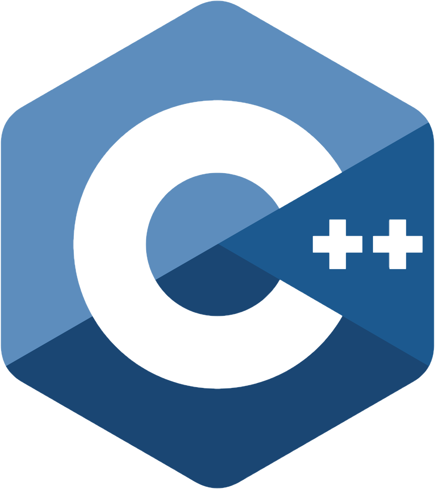

    

The Official C++ SDK for the Terra Ecosystem and for the UnrealEngine (LUNC/USTC/LUNA2)

 

  

  

  <a href="https://docs.terra.money/"><strong>Explore the Docs »</strong></a>
   
   
  <a href="https://github.com/terra-rebels/terra-sharp/tree/master/TerraSharp.Maui.Example">Example App</a>
  ·
  <a href="https://terra-rebels.github.io/terra-sharp/TerraSharp/Documentation/html/index.html">API Reference</a>
  ·
  <a href="https://www.nuget.org/packages/TerraSharp">Nuget Package</a>
  ·
  <a href="https://github.com/terra-rebels/Terra-Sharp">GitHub</a>

TerraC++ is a C++ SDK for writing applications that interact with the Terra blockchain from either the Web or Mobile, or .net environments and provides simple abstractions over core data structures, serialization, key management, and API request generation.

## Features

- **Written in C++**, with type definitions
- Works for UnrealEngine
- Versatile support for [key management](https://docs.terra.money/develop/terra-js/keys) solutions
- Exposes the Terra API through [`LCDClient`](https://docs.terra.money/docs/develop/sdks/terra-js/query-data.html)
- Parses responses into native C++ types

## License

This software is licensed under the MIT license. See [LICENSE](./LICENSE) for full disclosure.

© 2022 TerraRebels.
